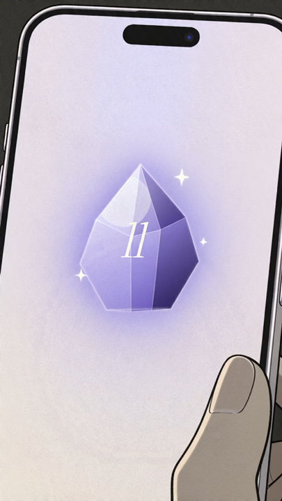
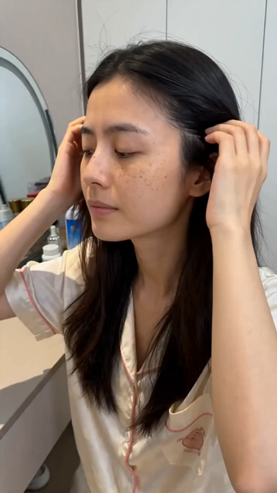
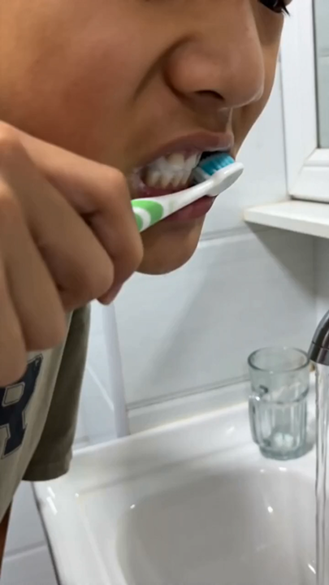

<div align="center">
  

  <h1>Thumb Brake 3s</h1>

  <p><strong>Tu producto tiene 3 segundos. Haz que el pulgar se detenga.</strong></p>

  <p>
    <a href="./README.md">English</a> ·
    <a href="./README.zh-CN.md">简体中文</a> ·
    <a href="./README.es.md"><strong>Español</strong></a>
  </p>

  <p>
    <a href="https://thumb-brake-3s.vercel.app"><strong>Demo en vivo</strong></a> ·
    <a href="#casos-en-video">Casos en video</a> ·
    <a href="#cómo-entendemos-los-hooks">Teoría</a> ·
    <a href="#inicio-rápido">Inicio rápido</a> ·
    <a href="#api">API</a> ·
    <a href="./DEPLOY.md">Deploy</a> ·
    <a href="./docs/project-guide.md">Guía del proyecto</a>
  </p>
</div>

---

## Un motor de hooks de 3 segundos para anuncios de producto en video corto

**Thumb Brake 3s** es un workspace creativo impulsado por LLM que convierte un producto, una imagen opcional, una categoría y una intención creativa en **tres hooks estructurados para anuncios de video corto**.

No es solo un generador de frases llamativas.

Construye cada hook como una **estructura de retención de 3 segundos**:

| Momento | Objetivo | Resultado |
|---|---|---|
| **0–1s** | Detener el pulgar | Una frase, imagen o interrupción que corta el scroll |
| **1–3s** | Probar relevancia | Escena, tensión, identidad, contraste o curiosidad |
| **3–7s** | Conectar con el producto | Puente natural hacia el producto y su resultado |

La versión actual genera **scripts y prompts**. No envía trabajos de generación de video, no requiere login, no cobra créditos, no guarda proyectos y no incluye dependencias privadas de plataforma.

---

## Demo

<p align="center">
  <a href="https://thumb-brake-3s.vercel.app">
    
  </a>
</p>

<p align="center">
  <a href="https://thumb-brake-3s.vercel.app"><strong>Abrir demo →</strong></a>
  ·
  <a href="./docs/video-cases.md"><strong>Ver casos en video →</strong></a>
</p>

---

## Casos en video

Estos ejemplos cortos muestran señales de detención, evidencia de escena y puentes de producto que Thumb Brake 3s ayuda a planificar.

| Interrupción urbana | Curiosidad de interfaz | Producto como héroe |
|---|---|---|
| [](./public/readme/videos/case-01.mp4) | [](./public/readme/videos/case-02.mp4) | [](./public/readme/videos/case-03.mp4) |

| Rutina auto-relevante | Puente cultural de acción | Prueba de comportamiento |
|---|---|---|
| [](./public/readme/videos/case-04.mp4) | [](./public/readme/videos/case-05.mp4) | [](./public/readme/videos/case-06.mp4) |

Lee las notas completas en [docs/video-cases.md](./docs/video-cases.md).

---

## Qué genera

Ejemplo de entrada:

```text
Producto: Pasta dental probiótica para niños
Categoría: Cuidado oral / cuidado oral infantil
Intención: Mi hijo no quiere cepillarse y siempre busca excusas.
Duración: 7s
```

Ejemplo de salida:

```text
Hook 1 · Dolor
0–1s  “¿Tu hijo también llora apenas ve el cepillo?”
1–3s  El niño se esconde; el padre sostiene el cepillo y duda.
3–7s  Cambia a una pasta dental infantil suave con sabor a uva para que empezar sea más fácil.

Hook 2 · Prueba
0–1s  “Las caries no siempre son por dulces. A veces el problema es que cepillarse nunca ocurre.”
1–3s  Primer plano de zonas sin limpiar y rechazo al sabor fuerte.
3–7s  Fórmula suave para encías, sabor amable, rutina más fácil.

Hook 3 · Audiencia
0–1s  “Para padres de niños de 3 a 6 años que negocian cada cepillado nocturno…”
1–3s  Baño cálido, cepillo pequeño, tabla de stickers, padre cansado.
3–7s  Primero reduce la resistencia; luego construye el hábito.
```

Cada resultado puede incluir título, estrategia, visual del primer segundo, script, timing de planos, overlays, sonido, puente de producto, prompt de primer frame y prompt completo para un flujo de video futuro.

---

## Por qué es diferente

La mayoría de generadores de hooks se quedan en slogans. Thumb Brake 3s genera una **estructura grabable**.

- **Biblioteca H1–H7 balanceada**: sensorial, conflicto, curiosidad, auto-relevancia, prueba, señal social y reconocimiento cultural.
- **Contrato de retención de 3s**: captar atención, probar relevancia y conectar con el producto.
- **Bloqueo de identidad de producto**: evita que el LLM cambie el producto, categoría o función.
- **Audiencia + escena**: evita textos genéricos como “para mamás” o “para oficinistas”.
- **Motivos culturales**: usa estructuras culturales sin copiar líneas de creadores ni assets protegidos.
- **Validación y reparación determinística**: mejora la estructura antes de devolver los resultados.
- **Compilador de prompt futuro**: prepara prompts listos para copiar en herramientas de video.

---

## Cómo entendemos los hooks

Thumb Brake 3s se basa en un contrato de atención de 3 segundos:

- `0–1s`: detener el pulgar
- `1–3s`: probar relevancia
- `3–7s`: conectar con el producto

Lee el desglose estético y técnico:

- [Hook Theory: The Thumb Brake 3s Deconstruction](./docs/hook-theory.md)
- [中文：Hook 理论与拆解](./docs/hook-theory.zh-CN.md)
- [Español: Teoría del Hook](./docs/hook-theory.es.md)

---

## Inicio rápido

### Requisitos

- Node.js 24 recomendado
- pnpm 10+
- Un endpoint OpenAI-compatible de chat completions

### Ejecutar localmente

```bash
pnpm install
cp .env.example .env.local
pnpm dev
```

Abre:

```text
http://localhost:3000
```

Configura `.env.local` antes de generar:

```bash
LLM_PROVIDER=openai-compatible
LLM_BASE_URL=https://api.openai.com/v1
LLM_API_KEY=your-api-key
LLM_MODEL=your-chat-model
```

Nunca subas `.env.local` ni claves reales al repositorio.

> El proyecto no incluye un generador fallback sin clave. Si faltan variables de LLM, la generación devuelve `LLM_CONFIG_REQUIRED`.

---

## Formas de uso

1. **Demo hospedada**: abre la demo, escribe el contexto del producto y copia los hooks.
2. **Laboratorio local**: usa tu propio endpoint LLM en tu máquina.
3. **Deploy propio**: Vercel o cualquier host con API routes de Next.js.
4. **API**: integra `POST /api/hook-generator/one-shot` en otro frontend.
5. **Core TypeScript**: importa `runHookOneShotGraph` en un servicio server-side.

---

## API

```bash
curl -X POST http://localhost:3000/api/hook-generator/one-shot \
  -H "Content-Type: application/json" \
  -d '{
    "productTitle": "Pasta dental infantil de baja espuma",
    "productImage": "",
    "intent": "pain_first",
    "intentText": "Mi hijo no quiere cepillarse y siempre busca excusas.",
    "analysisHints": {
      "productCategory": "oral_care"
    },
    "videoDuration": 7,
    "videoRatio": "9:16",
    "generateAudio": true
  }'
```

Intenciones soportadas:

```text
pain_first
audience_first
creative_first
offer_first
```

`videoDuration` acepta enteros de `4` a `9`.

---

## Estructura del proyecto

```text
app/                         App Next.js y API routes
components/hook-generator/   UI one-shot para generar hooks
data/hook-studio/            Biblioteca JSON/JSONL de recursos
lib/hook-generator-v2/       Grafo de generación, recursos, validación, compilador
lib/culture-motif-resources/ Recursos de motivos culturales
lib/hook-one-shot.ts         Selección de narrativas por intención
lib/hook-generator.ts        Generación LLM e identidad de producto
lib/hook-library.ts          Loader y recomendador de recursos
lib/llm-client.ts            Cliente OpenAI-compatible
tests/                       Cobertura Vitest
```

Guía completa: [docs/project-guide.md](./docs/project-guide.md).

---

## No incluido

- generación fallback sin LLM
- login o cuentas de usuario
- billing, créditos o medición de uso
- persistencia con Prisma/base de datos
- firma de uploads a cloud storage
- envío de jobs a Seedance, Sora, Veo u otros proveedores de video
- archivos `.env` reales o claves de producción

---

## Documentación

- [Project Guide](./docs/project-guide.md)
- [Hook Theory](./docs/hook-theory.es.md)
- [Video Case Gallery](./docs/video-cases.md)
- [Architecture](./docs/architecture.md)
- [Deployment](./DEPLOY.md)
- [AI Usage Guide](./AI_USAGE.md)
- [README Media Kit](./docs/readme-media-kit.md)

---

## License

MIT
