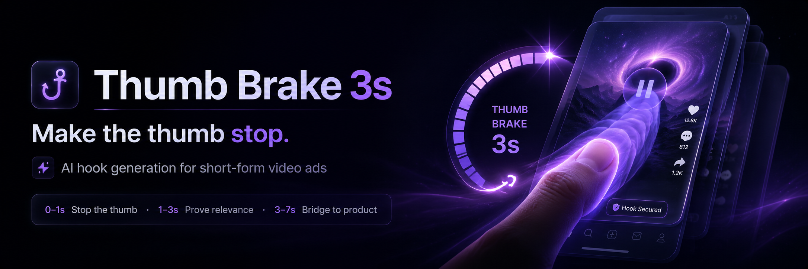

<div align="center">
  

  <h1>Thumb Brake 3s</h1>

  <p><strong>Your product has 3 seconds. Make the thumb stop.</strong></p>

  <p>
    <a href="./README.md"><strong>English</strong></a> ·
    <a href="./README.zh-CN.md">简体中文</a> ·
    <a href="./README.es.md">Español</a>
  </p>

  <p>
    <a href="https://thumb-brake-3s.vercel.app"><strong>Live Demo</strong></a> ·
    <a href="#video-cases">Video Cases</a> ·
    <a href="#ai-usage-guide">AI Usage</a> ·
    <a href="#how-we-think-about-hooks">Hook Theory</a> ·
    <a href="#quick-start">Quick Start</a> ·
    <a href="#api">API</a> ·
    <a href="./DEPLOY.md">Deploy</a> ·
    <a href="./docs/project-guide.md">Project Guide</a>
  </p>

  <p>
    
    
    
    
    
  </p>
</div>

---

## The 3-second hook engine for short-form product ads

**Thumb Brake 3s** is an LLM-powered creative workspace that turns a product, a rough angle, and a short intent into **three structured short-video ad hooks**.

It is not just another “write me a catchy line” generator.

It builds hooks as a **3-second retention structure**:

| Moment | Job | Output |
|---|---|---|
| **0–1s** | Stop the thumb | A sharp opening line or visual interruption |
| **1–3s** | Prove relevance | Scene evidence, tension, identity, contrast, or curiosity |
| **3–7s** | Bridge to product | A natural product/result bridge ready for production |

The current release is **script and prompt generation only**. It does **not** submit video-generation jobs, require login, charge credits, store projects, or ship private platform dependencies.

---

## Demo

<p align="center">
  <a href="https://thumb-brake-3s.vercel.app">
    
  </a>
</p>

<p align="center">
  <a href="https://thumb-brake-3s.vercel.app"><strong>Open the live demo →</strong></a>
  ·
  <a href="./docs/video-cases.md"><strong>Browse video cases →</strong></a>
</p>

---

## Video cases

These short examples show the kinds of first-second stop signals, scene evidence, and product-bridge moments the system is designed to plan.

<table>
  <tr>
    <td width="33%">
      <strong>Urban interruption</strong><br />
      <video src="https://raw.githubusercontent.com/NBrangerF/thumb-brake-3s/main/public/readme/videos/case-01.mp4" poster="https://raw.githubusercontent.com/NBrangerF/thumb-brake-3s/main/public/readme/video-posters/case-01.mp4.png" controls muted playsinline preload="metadata" width="100%"></video>
      <br /><a href="./public/readme/videos/case-01.mp4">Open MP4</a>
    </td>
    <td width="33%">
      <strong>Interface curiosity</strong><br />
      <video src="https://raw.githubusercontent.com/NBrangerF/thumb-brake-3s/main/public/readme/videos/case-02.mp4" poster="https://raw.githubusercontent.com/NBrangerF/thumb-brake-3s/main/public/readme/video-posters/case-02.mp4.png" controls muted playsinline preload="metadata" width="100%"></video>
      <br /><a href="./public/readme/videos/case-02.mp4">Open MP4</a>
    </td>
    <td width="33%">
      <strong>Product-as-hero motion</strong><br />
      <video src="https://raw.githubusercontent.com/NBrangerF/thumb-brake-3s/main/public/readme/videos/case-03.mp4" poster="https://raw.githubusercontent.com/NBrangerF/thumb-brake-3s/main/public/readme/video-posters/case-03.mp4.png" controls muted playsinline preload="metadata" width="100%"></video>
      <br /><a href="./public/readme/videos/case-03.mp4">Open MP4</a>
    </td>
  </tr>
  <tr>
    <td width="33%">
      <strong>Self-relevance routine</strong><br />
      <video src="https://raw.githubusercontent.com/NBrangerF/thumb-brake-3s/main/public/readme/videos/case-04.mp4" poster="https://raw.githubusercontent.com/NBrangerF/thumb-brake-3s/main/public/readme/video-posters/case-04.mp4.png" controls muted playsinline preload="metadata" width="100%"></video>
      <br /><a href="./public/readme/videos/case-04.mp4">Open MP4</a>
    </td>
    <td width="33%">
      <strong>Cultural action bridge</strong><br />
      <video src="https://raw.githubusercontent.com/NBrangerF/thumb-brake-3s/main/public/readme/videos/case-05.mp4" poster="https://raw.githubusercontent.com/NBrangerF/thumb-brake-3s/main/public/readme/video-posters/case-05.mp4.png" controls muted playsinline preload="metadata" width="100%"></video>
      <br /><a href="./public/readme/videos/case-05.mp4">Open MP4</a>
    </td>
    <td width="33%">
      <strong>Close-up behavior proof</strong><br />
      <video src="https://raw.githubusercontent.com/NBrangerF/thumb-brake-3s/main/public/readme/videos/case-06.mp4" poster="https://raw.githubusercontent.com/NBrangerF/thumb-brake-3s/main/public/readme/video-posters/case-06.mp4.png" controls muted playsinline preload="metadata" width="100%"></video>
      <br /><a href="./public/readme/videos/case-06.mp4">Open MP4</a>
    </td>
  </tr>
</table>

Read the full case notes in [docs/video-cases.md](./docs/video-cases.md).

---

## AI Usage Guide

Use this section when asking Codex, Cursor, Claude Code, or another coding agent to install, review, or deploy Thumb Brake 3s. The full standalone guide is also available in [AI_USAGE.md](./AI_USAGE.md).

### Pasteable install prompt

```text
Please set up this Thumb Brake 3s repository locally.

Requirements:
- Use pnpm.
- Do not print, inspect, or commit plaintext API keys.
- Copy .env.example to .env.local only if .env.local does not exist.
- Help me configure my own OpenAI-compatible LLM values in .env.local.
- Run pnpm install, pnpm test, pnpm lint, pnpm typecheck, and pnpm build.
- Start pnpm dev and tell me the local URL.
- If LLM config is missing, explain that generation requires LLM_BASE_URL, LLM_API_KEY, and LLM_MODEL.
- Do not add fallback generation, auth, billing, database, upload signing, or video job submission.
```

### Pasteable deployment prompt

```text
Please deploy this Thumb Brake 3s Next.js app.

Requirements:
- Use a host that supports Next.js API routes, preferably Vercel.
- Configure LLM_PROVIDER, LLM_BASE_URL, LLM_API_KEY, and LLM_MODEL as server-side environment variables.
- Never expose the API key with NEXT_PUBLIC_.
- Run pnpm test, pnpm lint, pnpm typecheck, and pnpm build before deployment.
- Verify the production deployment is Ready.
- Do not print the API key.
```

### Pasteable project review prompt

```text
Please review this Thumb Brake 3s repository.

Focus on:
- Whether pnpm install && pnpm dev works locally.
- Whether pnpm test, pnpm lint, pnpm typecheck, and pnpm build pass.
- Whether README.md, README.zh-CN.md, README.es.md, DEPLOY.md, AI_USAGE.md, and docs/project-guide.md match the actual code.
- Whether .env.local, real API keys, .DS_Store, node_modules, and .next are excluded.
- Whether the app still requires an LLM and does not silently fallback without a key.
- Whether no auth, billing, database, upload signing, or video job submission code was reintroduced.
```

### Agent safety checklist

- Keep LLM keys server-side only; never use `NEXT_PUBLIC_` for secrets.
- Do not print `.env.local`, shell history, or provider credentials.
- Do not commit `.env.local`, `.env`, generated `.next`, `node_modules`, media test output, or `.DS_Store`.
- If LLM config is missing, generation should fail clearly with `LLM_CONFIG_REQUIRED`.
- Do not add a no-key fallback generator; Thumb Brake 3s intentionally requires an LLM.

---

## What it generates

Give it a product like:

```text
Product: Kids probiotic toothpaste
Category: Oral care / kids oral care
Intent: My child refuses to brush teeth and always finds excuses.
Duration: 7s
```

It returns three differentiated hook cards:

```text
Hook 1 · Pain
0–1s  “Does your kid also cry the moment the toothbrush appears?”
1–3s  Child hides in the corner; parent holds the toothbrush and hesitates.
3–7s  Switch to a gentle grape-flavored kids toothpaste that makes brushing feel less like a fight.

Hook 2 · Proof
0–1s  “Cavities are not always about candy. Sometimes brushing is the real battle.”
1–3s  Close-up of missed corners and a child refusing the minty sting.
3–7s  Probiotic gum-care formula, gentle taste, cleaner routine.

Hook 3 · Audience
0–1s  “For parents of 3–6 year olds who negotiate every bedtime brush…”
1–3s  Warm bathroom scene, sticker chart, tiny toothbrush, tired parent.
3–7s  Make the first brush easier, then build the habit.
```

Each result can include:

- hook title and strategy label
- first-second visual direction
- short script / dialogue
- shot timing
- text overlays
- sound direction
- product bridge
- first-frame prompt
- copy-ready future video prompt

---

## Why it is different

Most hook generators stop at slogans.

Thumb Brake 3s uses a resource-backed creative pipeline:

- **Balanced H1–H7 hook library** — sensory, conflict, curiosity, self-relevance, proof, social signal, and cultural recognition patterns.
- **3s retention contract** — every hook must earn attention, prove relevance, and bridge to product.
- **Product identity lock** — the product should not drift into a different object or category.
- **Audience + scene logic** — avoids generic “for moms / for women / for office workers” copy by grounding hooks in visible situations.
- **Culture motif borrowing** — uses cultural structures and visual motifs without copying creator lines or copyrighted assets.
- **Deterministic validation and repair** — catches weak structure before returning the final cards.
- **Future video prompt compiler** — prepares structured prompts for downstream video tools, while keeping v1 script-first.

---

## How we think about hooks

Thumb Brake 3s is built around a 3-second attention contract:

- `0–1s`: stop the thumb
- `1–3s`: prove relevance
- `3–7s`: bridge into the product

Read the aesthetic and technical breakdown:

- [Hook Theory: The Thumb Brake 3s Deconstruction](./docs/hook-theory.md)
- [中文：Hook 理论与拆解](./docs/hook-theory.zh-CN.md)
- [Español: Teoría del Hook](./docs/hook-theory.es.md)

---

## Features

| Feature | Status |
|---|---:|
| One-shot web UI | ✅ |
| Local product image preview | ✅ |
| Four creative intents: pain, audience, story, offer | ✅ |
| 4–9 second script duration | ✅ |
| OpenAI-compatible LLM endpoint | ✅ |
| Three differentiated hook cards | ✅ |
| Hook Studio resource library | ✅ |
| Balanced 2026 pattern expansion | ✅ |
| Culture motif resources | ✅ |
| Deterministic validation and repair | ✅ |
| Copy-ready future video prompt | ✅ |
| Built-in video generation jobs | Not in v1 |
| Accounts, billing, credits, database | Not included |

---

## Quick Start

### Requirements

- Node.js 24 recommended
- pnpm 10+
- An OpenAI-compatible chat completions endpoint

### Run locally

```bash
pnpm install
cp .env.example .env.local
pnpm dev
```

Open:

```text
http://localhost:3000
```

Configure `.env.local` before generating scripts:

```bash
LLM_PROVIDER=openai-compatible
LLM_BASE_URL=https://api.openai.com/v1
LLM_API_KEY=your-api-key
LLM_MODEL=your-chat-model
```

Never commit `.env.local` or any real API key.

> Thumb Brake 3s intentionally does not include a no-key fallback generator. If the LLM variables are missing, generation fails with `LLM_CONFIG_REQUIRED`.

---

## Ways to use

### 1. Use the hosted demo

Open the public demo, enter product context, choose a creative angle, generate three hook scripts, and copy the result.

[Open live demo →](https://thumb-brake-3s.vercel.app)

### 2. Run your own local creative lab

Use your own LLM endpoint and test hook variants privately on your machine.

```bash
pnpm install
cp .env.example .env.local
pnpm dev
```

### 3. Deploy your own instance

Deploy to Vercel or any host that supports Next.js API routes and server-side environment variables.

Read [DEPLOY.md](./DEPLOY.md).

### 4. Integrate the API

Call the built-in route from another frontend or workflow.

```text
POST /api/hook-generator/one-shot
```

### 5. Integrate the core

Use the server-side generation graph directly inside another TypeScript/Next.js service.

```ts
import { runHookOneShotGraph } from "@/lib/hook-generator-v2/graph/run-hook-one-shot-graph"
```

---

## API

Example request:

```bash
curl -X POST http://localhost:3000/api/hook-generator/one-shot \
  -H "Content-Type: application/json" \
  -d '{
    "productTitle": "Kids low-foam toothpaste",
    "productImage": "",
    "intent": "pain_first",
    "intentText": "My child refuses to brush teeth and always finds excuses.",
    "analysisHints": {
      "productCategory": "oral_care"
    },
    "videoDuration": 7,
    "videoRatio": "9:16",
    "generateAudio": true
  }'
```

Supported intents:

```text
pain_first
audience_first
creative_first
offer_first
```

`videoDuration` supports integers from `4` to `9`.

---

## Project structure

```text
app/                         Next.js app and API routes
components/hook-generator/   One-shot web UI
data/hook-studio/            JSON/JSONL Hook Studio resource library
lib/hook-generator-v2/       Generation graph, resources, validation, compiler
lib/culture-motif-resources/ Culture motif ranking and borrowing resources
lib/hook-one-shot.ts         Intent-based hook narrative selection
lib/hook-generator.ts        LLM script generation and product identity locking
lib/hook-library.ts          Resource loader and recommendation helpers
lib/llm-client.ts            OpenAI-compatible chat completions client
tests/                       Vitest coverage
```

For the full module-by-module guide, read [docs/project-guide.md](./docs/project-guide.md).

---

## Documentation

- [Project Guide](./docs/project-guide.md) — full module and runtime map
- [Hook Theory](./docs/hook-theory.md) — the 3-second attention model behind the generator
- [Video Case Gallery](./docs/video-cases.md) — public video examples and notes
- [Architecture](./docs/architecture.md) — layers, flow, and boundaries
- [Deployment](./DEPLOY.md) — Vercel and Node deployment
- [AI Usage Guide](./AI_USAGE.md) — prompts for Codex, Cursor, Claude Code, and other agents
- [README Media Kit](./docs/readme-media-kit.md) — screenshots, videos, examples, and launch assets
- [中文 README](./README.zh-CN.md)
- [Español README](./README.es.md)

---

## What is not included

Thumb Brake 3s is intentionally focused.

It does not include:

- built-in non-LLM fallback generation
- login or user accounts
- billing, credits, or usage metering
- Prisma/database persistence
- cloud file upload signing
- Seedance, Sora, Veo, or other video job submission
- production env files or real API keys

Video generation provider adapters can be added later without changing the core script-first architecture.

---

## Verification

Run before publishing or deploying:

```bash
pnpm install
pnpm test
pnpm lint
pnpm typecheck
pnpm build
```

Optional safety scan:

```bash
find . -name .DS_Store -print
rg -n "sk-|api[_-]?key\s*[:=]|secret\s*[:=]|password\s*[:=]|BEGIN [A-Z ]*PRIVATE KEY" .
rg -n "@/lib/(auth|db|company-scope|platform-pricing|cost-feature)|@/app/api/(seedance|model-workbench)" .
```

Expected result: no local artifacts, no real secrets, and no private platform imports.

---

## Roadmap

- [x] README hero, multilingual docs, hook theory, and public video case gallery
- [ ] Walkthrough demo video for the live app
- [ ] More product category playbooks
- [ ] More multilingual prompt resources
- [ ] Optional export formats for creators and agencies
- [ ] Optional provider adapters for video generation
- [ ] Optional project persistence through user-provided storage

---

## Contributing

Issues and pull requests are welcome.

Good first contributions:

- add more hook pattern cards
- improve category playbooks
- add tests for edge-case products
- improve Spanish / Chinese documentation
- build a provider adapter behind an explicit feature flag

Please keep the repo public-safe: no real keys, no private platform imports, no generated build output.

---

## License

MIT
