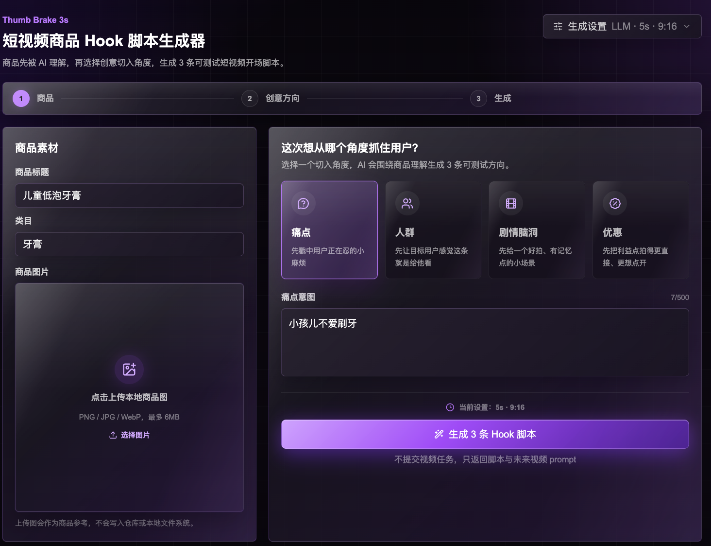

<div align="center">
  

  <h1>Thumb Brake 3s</h1>

  <p><strong>你的商品只有 3 秒。先让拇指停下来。</strong></p>

  <p>
    <a href="./README.md">English</a> ·
    <a href="./README.zh-CN.md"><strong>简体中文</strong></a> ·
    <a href="./README.es.md">Español</a>
  </p>

  <p>
    <a href="https://thumb-brake-3s.vercel.app"><strong>在线体验</strong></a> ·
    <a href="#视频案例">视频案例</a> ·
    <a href="#ai-使用指南">AI 使用指南</a> ·
    <a href="#我们如何理解-hook">Hook 理论</a> ·
    <a href="#快速开始">快速开始</a> ·
    <a href="#api">API</a> ·
    <a href="./DEPLOY.md">部署</a> ·
    <a href="./docs/project-guide.md">项目指南</a>
  </p>
</div>

---

## 面向短视频商品广告的 3 秒 Hook 引擎

**Thumb Brake 3s** 是一个 LLM 驱动的短视频商品 Hook 创意工作台。你输入商品、类目、图片和一个粗略意图，它会生成 **3 条结构化的短视频广告开头脚本**。

它不是普通的“帮我写一句广告语”。

它把 Hook 拆成一个 **3 秒停滑结构**：

| 时间 | 任务 | 输出 |
|---|---|---|
| **0–1s** | 停住拇指 | 强停滑句、视觉打断、冲突或反常识 |
| **1–3s** | 证明相关 | 场景证据、人群识别、问题承接、好奇缺口 |
| **3–7s** | 桥接产品 | 自然把用户注意力接到产品和结果 |

当前版本是 **脚本和 prompt 生成器**。它不会提交视频生成任务，不需要登录，不包含计费、积分、数据库、云上传或私有平台依赖。

---

## Demo

<p align="center">
  <a href="https://thumb-brake-3s.vercel.app">
    
  </a>
</p>

<p align="center">
  <a href="https://thumb-brake-3s.vercel.app"><strong>打开在线 Demo →</strong></a>
  ·
  <a href="./docs/video-cases.md"><strong>查看视频案例 →</strong></a>
</p>

---

## 视频案例

这些短片用于展示 Thumb Brake 3s 关注的第一秒停滑信号、场景证据和产品桥接方式。

<table>
  <tr>
    <td width="33%">
      <strong>城市场景打断</strong><br />
      <video src="https://raw.githubusercontent.com/NBrangerF/thumb-brake-3s/main/public/readme/videos/case-01.mp4" poster="https://raw.githubusercontent.com/NBrangerF/thumb-brake-3s/main/public/readme/video-posters/case-01.mp4.png" controls muted playsinline preload="metadata" width="100%"></video>
      <br /><a href="./public/readme/videos/case-01.mp4">打开 MP4</a>
    </td>
    <td width="33%">
      <strong>UI 好奇缺口</strong><br />
      <video src="https://raw.githubusercontent.com/NBrangerF/thumb-brake-3s/main/public/readme/videos/case-02.mp4" poster="https://raw.githubusercontent.com/NBrangerF/thumb-brake-3s/main/public/readme/video-posters/case-02.mp4.png" controls muted playsinline preload="metadata" width="100%"></video>
      <br /><a href="./public/readme/videos/case-02.mp4">打开 MP4</a>
    </td>
    <td width="33%">
      <strong>产品英雄运动</strong><br />
      <video src="https://raw.githubusercontent.com/NBrangerF/thumb-brake-3s/main/public/readme/videos/case-03.mp4" poster="https://raw.githubusercontent.com/NBrangerF/thumb-brake-3s/main/public/readme/video-posters/case-03.mp4.png" controls muted playsinline preload="metadata" width="100%"></video>
      <br /><a href="./public/readme/videos/case-03.mp4">打开 MP4</a>
    </td>
  </tr>
  <tr>
    <td width="33%">
      <strong>自我相关日常</strong><br />
      <video src="https://raw.githubusercontent.com/NBrangerF/thumb-brake-3s/main/public/readme/videos/case-04.mp4" poster="https://raw.githubusercontent.com/NBrangerF/thumb-brake-3s/main/public/readme/video-posters/case-04.mp4.png" controls muted playsinline preload="metadata" width="100%"></video>
      <br /><a href="./public/readme/videos/case-04.mp4">打开 MP4</a>
    </td>
    <td width="33%">
      <strong>文化动作桥接</strong><br />
      <video src="https://raw.githubusercontent.com/NBrangerF/thumb-brake-3s/main/public/readme/videos/case-05.mp4" poster="https://raw.githubusercontent.com/NBrangerF/thumb-brake-3s/main/public/readme/video-posters/case-05.mp4.png" controls muted playsinline preload="metadata" width="100%"></video>
      <br /><a href="./public/readme/videos/case-05.mp4">打开 MP4</a>
    </td>
    <td width="33%">
      <strong>近景行为证明</strong><br />
      <video src="https://raw.githubusercontent.com/NBrangerF/thumb-brake-3s/main/public/readme/videos/case-06.mp4" poster="https://raw.githubusercontent.com/NBrangerF/thumb-brake-3s/main/public/readme/video-posters/case-06.mp4.png" controls muted playsinline preload="metadata" width="100%"></video>
      <br /><a href="./public/readme/videos/case-06.mp4">打开 MP4</a>
    </td>
  </tr>
</table>

完整案例说明见 [docs/video-cases.md](./docs/video-cases.md)。

---

## AI 使用指南

当你让 Codex、Cursor、Claude Code 或其他代码 Agent 安装、审查、部署这个仓库时，可以直接使用下面的提示词。完整版本见 [AI_USAGE.md](./AI_USAGE.md)。

### 安装提示词

```text
Please set up this Thumb Brake 3s repository locally.

Requirements:
- Use pnpm.
- Do not print, inspect, or commit plaintext API keys.
- Copy .env.example to .env.local only if .env.local does not exist.
- Help me configure my own OpenAI-compatible LLM values in .env.local.
- Run pnpm install, pnpm test, pnpm lint, pnpm typecheck, and pnpm build.
- Start pnpm dev and tell me the local URL.
- If LLM config is missing, explain that generation requires LLM_BASE_URL, LLM_API_KEY, and LLM_MODEL.
- Do not add fallback generation, auth, billing, database, upload signing, or video job submission.
```

### 部署提示词

```text
Please deploy this Thumb Brake 3s Next.js app.

Requirements:
- Use a host that supports Next.js API routes, preferably Vercel.
- Configure LLM_PROVIDER, LLM_BASE_URL, LLM_API_KEY, and LLM_MODEL as server-side environment variables.
- Never expose the API key with NEXT_PUBLIC_.
- Run pnpm test, pnpm lint, pnpm typecheck, and pnpm build before deployment.
- Verify the production deployment is Ready.
- Do not print the API key.
```

### 项目审查提示词

```text
Please review this Thumb Brake 3s repository.

Focus on:
- Whether pnpm install && pnpm dev works locally.
- Whether pnpm test, pnpm lint, pnpm typecheck, and pnpm build pass.
- Whether README.md, README.zh-CN.md, README.es.md, DEPLOY.md, AI_USAGE.md, and docs/project-guide.md match the actual code.
- Whether .env.local, real API keys, .DS_Store, node_modules, and .next are excluded.
- Whether the app still requires an LLM and does not silently fallback without a key.
- Whether no auth, billing, database, upload signing, or video job submission code was reintroduced.
```

### Agent 安全清单

- LLM key 只能放在服务端环境变量中，不要使用 `NEXT_PUBLIC_` 暴露。
- 不要打印 `.env.local`、shell history 或供应商密钥。
- 不要提交 `.env.local`、`.env`、生成后的 `.next`、`node_modules`、测试媒体输出或 `.DS_Store`。
- 缺少 LLM 配置时，生成接口应明确返回 `LLM_CONFIG_REQUIRED`。
- 不要加入无 key fallback；Thumb Brake 3s 故意要求配置 LLM。

---

## 它会生成什么

例如输入：

```text
商品：儿童益生菌牙膏
类目：口腔护理 / 儿童口腔护理
意图：孩子不爱刷牙，总是找借口
时长：7s
```

它会返回三条不同角度的 Hook 卡：

```text
Hook 1 · 痛点
0–1s  “你家孩子也一看到牙刷就哭吗？”
1–3s  孩子躲在角落摇头，妈妈拿着牙刷迟疑。
3–7s  换成温和葡萄味儿童牙膏，先让孩子愿意张口，再谈刷干净。

Hook 2 · 证明
0–1s  “蛀牙不一定是糖的问题，可能是刷牙这一步根本没完成。”
1–3s  牙缝特写、孩子抗拒薄荷刺激、家长无奈。
3–7s  益生菌护龈配方，温和清洁，让刷牙变得更容易开始。

Hook 3 · 人群
0–1s  “给每天睡前都要谈判刷牙的 3–6 岁家长。”
1–3s  卫生间、贴纸表、小牙刷、疲惫但耐心的家长。
3–7s  先减少抗拒，再慢慢建立习惯。
```

每条结果可以包含：Hook 标题、策略标签、第一秒画面、短脚本、镜头节奏、字幕、声音方向、产品桥接、首帧 prompt 和完整未来视频 prompt。

---

## 为什么不一样

大多数 Hook 工具只生成句子。Thumb Brake 3s 生成的是 **可拍摄的 3 秒结构**。

- **均衡 H1–H7 Hook Library**：感官、冲突、好奇、自我相关、结果证明、社交信号、文化识别。
- **3 秒停滑协议**：每条 Hook 都必须先抓注意力，再证明相关，最后桥接产品。
- **商品身份锁定**：避免 LLM 把商品写偏、换品类、换功能。
- **人群 + 场景逻辑**：避免“给女生”“宝妈必买”这类空泛定向文案。
- **文化 motif 借用**：借用文化结构和视觉语法，而不是复制创作者原话或素材。
- **确定性校验与修复**：在返回结果前修复结构问题。
- **未来视频 prompt 编译**：方便后续复制到视频生成工作流。

---

## 我们如何理解 Hook

Thumb Brake 3s 围绕一个 3 秒注意力协议构建：

- `0–1s`：停住拇指
- `1–3s`：证明相关
- `3–7s`：桥接产品

阅读完整拆解：

- [Hook Theory: The Thumb Brake 3s Deconstruction](./docs/hook-theory.md)
- [中文：Hook 理论与拆解](./docs/hook-theory.zh-CN.md)
- [Español: Teoría del Hook](./docs/hook-theory.es.md)

---

## 快速开始

### 环境要求

- 推荐 Node.js 24
- pnpm 10+
- 一个 OpenAI-compatible chat completions endpoint

### 本地运行

```bash
pnpm install
cp .env.example .env.local
pnpm dev
```

打开：

```text
http://localhost:3000
```

生成前需要配置 `.env.local`：

```bash
LLM_PROVIDER=openai-compatible
LLM_BASE_URL=https://api.openai.com/v1
LLM_API_KEY=your-api-key
LLM_MODEL=your-chat-model
```

不要提交 `.env.local` 或任何真实 API key。

> 项目故意不提供无 key fallback 生成器。缺少 LLM 配置时，接口会返回 `LLM_CONFIG_REQUIRED`。

---

## 使用方式

1. **使用在线 Demo**：打开 Vercel demo，输入商品信息，生成并复制结果。
2. **本地运行**：用自己的 LLM endpoint 在本机测试。
3. **自部署**：部署到 Vercel 或支持 Next.js API routes 的服务器。
4. **调用 API**：通过 `POST /api/hook-generator/one-shot` 集成到其他前端或自动化流程。
5. **集成核心图**：在服务端 TypeScript 项目里直接调用 `runHookOneShotGraph`。

---

## API

```bash
curl -X POST http://localhost:3000/api/hook-generator/one-shot \
  -H "Content-Type: application/json" \
  -d '{
    "productTitle": "儿童低泡牙膏",
    "productImage": "",
    "intent": "pain_first",
    "intentText": "孩子不爱刷牙，总是找借口。",
    "analysisHints": {
      "productCategory": "oral_care"
    },
    "videoDuration": 7,
    "videoRatio": "9:16",
    "generateAudio": true
  }'
```

支持的 intent：

```text
pain_first
audience_first
creative_first
offer_first
```

`videoDuration` 支持 `4` 到 `9` 的整数。

---

## 项目结构

```text
app/                         Next.js 页面和 API routes
components/hook-generator/   One-shot Hook 生成 UI
data/hook-studio/            Hook Studio JSON/JSONL 资源库
lib/hook-generator-v2/       生成图、资源注入、校验、prompt 编译
lib/culture-motif-resources/ 文化 motif 排序与借用资源
lib/hook-one-shot.ts         基于意图的 Hook narrative 选择
lib/hook-generator.ts        LLM 脚本生成与商品身份锁定
lib/hook-library.ts          资源加载和推荐逻辑
lib/llm-client.ts            OpenAI-compatible LLM client
tests/                       Vitest 测试
```

完整模块指南见 [docs/project-guide.md](./docs/project-guide.md)。

---

## 不包含什么

Thumb Brake 3s 当前不包含：

- 无 LLM key 的本地假生成器
- 登录 / 用户系统
- 计费、积分、用量统计
- Prisma / 数据库存储
- 云文件上传签名
- Seedance、Sora、Veo 或其他视频生成任务提交
- 生产环境变量或真实 API key

后续可以通过显式 adapter 增加视频生成能力，但 V1 保持脚本优先。

---

## 文档

- [Project Guide](./docs/project-guide.md)
- [Hook Theory](./docs/hook-theory.zh-CN.md)
- [Video Case Gallery](./docs/video-cases.md)
- [Architecture](./docs/architecture.md)
- [Deployment](./DEPLOY.md)
- [AI Usage Guide](./AI_USAGE.md)
- [README Media Kit](./docs/readme-media-kit.md)

---

## License

MIT
