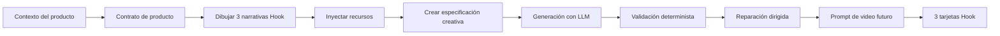

# Teoría del Hook: la descomposición de Thumb Brake 3s

[English](hook-theory.md) · [中文](hook-theory.zh-CN.md) · [Español](hook-theory.es.md)

> Tu producto tiene **3 segundos**.
>
> Un buen Hook no le pide atención al usuario. Hace que la atención ocurra de inmediato.

Thumb Brake 3s parte de una idea simple: un Hook para video corto no es una frase ingeniosa al inicio. Es un **sistema de atención comprimido en el tiempo**. Tiene que frenar el pulgar, demostrar relevancia y conectar con el producto antes de que la persona vuelva al feed.

Este documento explica cómo el proyecto entiende, descompone y genera Hooks.

---

## 1. La definición corta

Un Hook es un **contrato de atención de 3 segundos**.

```text
0–1s   Frenar el pulgar
1–3s   Demostrar “esto es para mí”
3–7s   Conectar con el producto
```

El primer segundo interrumpe.  
Los siguientes dos segundos justifican la atención.  
Los segundos posteriores transforman esa atención en un momento útil para el producto.

Un Hook débil dice:

> “Aquí hay un producto.”

Un Hook más fuerte dice:

> “Este momento ya existe en tu vida — y este producto encaja dentro de él.”

---

## 2. La premisa estética

La atención en video corto es física.

Al principio, la persona no “evalúa contenido” de forma racional. Siente una pequeña fricción dentro del feed:

- una mano entra de golpe en el encuadre
- un objeto se comporta de manera extraña
- una frase nombra una situación demasiado específica
- un sonido rompe el ritmo de scroll
- un antes/después se ve demasiado concreto para ignorarlo
- un momento social parece estar ocurriendo de verdad

Un buen Hook se siente como un pequeño tope de velocidad para el pulgar.

El nombre del proyecto es literal: **Thumb Brake 3s** busca diseñar esos instantes en los que el dedo desacelera lo suficiente para que llegue el significado.

---

## 3. La premisa técnica

Dentro de este proyecto, un Hook se trata como un activo creativo estructurado, no como una frase suelta.

Un Hook necesita al menos siete componentes:

| Componente | Qué hace | Ejemplo |
|---|---|---|
| Señal de freno | Interrumpe el patrón del feed | Primer plano repentino, movimiento raro, frase fuerte, corte de silencio |
| Prueba de relevancia | Muestra por qué debería importar | Rutina, identidad, dolor, deseo o situación reconocible |
| Tensión | Da una razón para seguir mirando | Algo falla, falta, sorprende o queda sin resolver |
| Evidencia de escena | Hace visible el Hook | Objetos, gestos, entorno, momento, reacción, estado de pantalla |
| Bucle abierto | Retrasa el cierre | “Espera, ¿por qué pasó eso?” |
| Puente de producto | Conecta la atención con el producto | Producto como herramienta, prueba, atajo o resolución |
| Límite de afirmaciones | Mantiene credibilidad y seguridad | Sin pruebas falsas, sin promesas médicas exageradas, sin garantías de targeting |

Una tarjeta de Hook solo es útil cuando estas piezas se conectan.

---

## 4. La línea de tiempo de 3 segundos

La estructura central no es “intro → cuerpo → CTA”. Es más comprimida.

```text
┌───────────────┬──────────────────────────┬──────────────────────────────┐
│ 0–1s          │ 1–3s                    │ 3–7s                         │
│ Señal de freno│ Prueba de relevancia     │ Puente de producto           │
├───────────────┼──────────────────────────┼──────────────────────────────┤
│ Hacer que la  │ Hacer que la persona     │ Hacer que el producto se     │
│ persona pare. │ sienta: “esto soy yo”.   │ sienta natural y útil.       │
└───────────────┴──────────────────────────┴──────────────────────────────┘
```

### 0–1s: frenar el pulgar

Esta es la capa de interrupción.

El sistema busca señales como:

- ruptura visual
- contraste sonoro
- llamado directo a una audiencia
- comportamiento imposible de un objeto
- momento de dolor inmediato
- prueba social que entra en escena
- texto en pantalla con alta especificidad

La persona no necesita entenderlo todo todavía. Solo necesita no deslizar.

### 1–3s: demostrar relevancia

Esta es la capa de reconocimiento.

El Hook debe responder:

> “¿Por qué esta persona debería seguir mirando?”

La relevancia puede venir de:

- “Ese es mi problema.”
- “Esa es mi rutina.”
- “Esa es mi identidad.”
- “Ese es el resultado que quiero.”
- “Esa escena me resulta familiar.”
- “Esa prueba se ve lo bastante visible como para comprobarla.”

### 3–7s: conectar con el producto

Esta es la capa comercial.

El producto no debe sentirse pegado encima. Debe entrar como:

- la herramienta faltante
- el paso más fácil
- el objeto de prueba
- la resolución de la escena
- la liberación emocional
- la siguiente acción

Un Hook falla cuando el producto llega como una interrupción publicitaria.  
Un Hook funciona cuando el producto se siente como la razón por la que la escena puede resolverse.

---

## 5. Las siete familias de Hook

Thumb Brake 3s utiliza una taxonomía balanceada H1–H7. Estas familias no son categorías rígidas de contenido. Son **trabajos de atención**.

| Tipo | Nombre | Trabajo de atención | Falla común |
|---|---|---|---|
| H1 | Interrupción sensorial | Frenar el feed con vista, sonido, textura, movimiento o ritmo | Visual bonito sin relevancia |
| H2 | Tensión / conflicto | Hacer sentir que un problema ocurre ahora | Drama sin conexión al producto |
| H3 | Brecha de curiosidad | Crear una causa ausente, razón oculta o revelación demorada | Clickbait sin recompensa |
| H4 | Auto-relevancia | Hacer que la persona reconozca su rol, rutina o identidad | Etiquetas genéricas como “para mujeres” o “para mamás” |
| H5 | Prueba / resultado | Mostrar al producto funcionando, cambiando o resolviendo | Afirmaciones no sustentadas |
| H6 | Señal social | Usar comentarios, reacciones, validación o contexto de creador | Prueba social falsa o UGC demasiado actuado |
| H7 | Reconocimiento cultural | Tomar una forma, ritual, meme o gramática cultural reconocible | Copiar IP, tendencias gastadas o frases de creadores |

El generador no elige una familia y escribe una línea. Dibuja narrativas diferenciadas, inyecta restricciones de recursos y le pide al modelo producir tres conceptos de apertura distintos.

---

## 6. Gramática del Hook

La mayoría de los Hooks efectivos se pueden describir con esta gramática:

```text
[Audiencia o momento]
+ [evidencia observable de escena]
+ [tensión o bucle abierto]
+ [puente de producto]
+ [límite de afirmaciones]
```

Ejemplo:

```text
Para padres de niños que odian cepillarse
+ evasión antes de dormir, boca cerrada, duda del adulto
+ “¿por qué cepillarse se vuelve una negociación cada noche?”
+ pasta dental infantil sabor uva entra como primer paso de menor fricción
+ sin promesa médica, sin vergüenza, sin garantía
```

Esta gramática evita que el Hook se convierta en:

- una frase publicitaria genérica, o
- una escena cinematográfica sin lógica comercial.

---

## 7. ¿Qué hace bueno a un Hook?

Un buen Hook no siempre es ruidoso. Primero es **específico**.

### Débil

```text
Kids love this toothpaste!
```

### Más fuerte

```text
Your kid does not hate brushing. They hate the first 10 seconds.
```

Por qué funciona:

- Reencuadra el problema.
- Nombra un comportamiento específico.
- Crea una pequeña brecha de curiosidad.
- Deja espacio para el puente del producto.

---

### Débil

```text
For busy moms.
```

### Más fuerte

```text
For the parent who has already asked “go brush your teeth” four times tonight.
```

Por qué funciona:

- Nombra un momento real.
- Evita una etiqueta demográfica plana.
- Crea auto-reconocimiento con evidencia de escena.

---

### Débil

```text
This cleaning spray is amazing.
```

### Más fuerte

```text
If the stain disappears before the towel moves, people stop scrolling.
```

Por qué funciona:

- Empieza con prueba visible.
- Convierte la acción del producto en una prueba visual.
- Entiende el feed como un entorno de demostración.

---

## 8. Las pattern cards son operadores, no copy

La biblioteca de recursos no es una lista de anuncios terminados.

Una buena pattern card debe funcionar como un operador:

```text
Toma este producto.
Ponlo dentro de este mecanismo de atención.
Añade este tipo de evidencia de escena.
Evita estos modos de falla.
Conecta con el producto de esta manera.
```

Mal diseño de recursos:

```text
“Aquí hay 50 frases virales de apertura.”
```

Buen diseño de recursos:

```text
“Aquí hay 50 formas de crear una señal de freno, demostrar relevancia y conectar con el producto.”
```

La diferencia importa. Thumb Brake 3s no busca copiar frases virales. Busca generar lógica creativa reutilizable.

---

## 9. Los few-shots son brújulas, no plantillas

Los few-shots guían ritmo, especificidad, estructura y lógica de escena.

No deben copiarse palabra por palabra.

Un buen few-shot enseña:

- qué tan rápido se mueve la apertura
- qué evidencia visual debe aparecer
- cómo mantener la identidad del producto
- cuándo debe entrar el producto
- qué prueba o emoción es aceptable
- qué no debe prometer demasiado

Un few-shot tiene éxito cuando ayuda al modelo a generar un nuevo Hook nativo para el producto, no cuando produce una copia cercana.

---

## 10. El puente de producto

Un Hook sin puente es solo atención.

El producto puede entrar con distintos roles:

| Rol de puente | Significado |
|---|---|
| Herramienta | El producto ayuda a realizar la tarea |
| Atajo | Reduce esfuerzo o pasos |
| Objeto de prueba | Produce un resultado visible |
| Objeto de confort | Reduce fricción, miedo, dolor o duda |
| Objeto ritual | Encaja en una rutina repetida |
| Objeto de control | Hace que la persona se sienta más preparada o capaz |
| Resolución de escena | Resuelve la tensión inicial |

El puente debe sentirse ganado. Si los primeros segundos hablan de un problema y el producto resuelve otro, el Hook se rompe.

---

## 11. Préstamo cultural

La cultura puede crear reconocimiento inmediato.

Pero este proyecto trata el préstamo cultural como **inspiración estructural**, no como copia.

Préstamo cultural seguro:

- un ritual social familiar
- un formato de video reconocible
- una gramática estética amplia
- un ritmo de género
- una forma de escena no específica
- una mecánica abstracta de meme

Préstamo cultural inseguro:

- frases exactas de creadores
- transcripciones privadas de anuncios
- nombres de usuario
- personajes protegidos por copyright
- IP protegida
- creatividad directa de competidores
- assets descargados de anuncios

El objetivo no es robar una tendencia.  
El objetivo es entender por qué produce reconocimiento y reconstruir ese mecanismo alrededor del producto.

---

## 12. Cómo Thumb Brake 3s genera Hooks

El flujo de generación busca mantener el resultado expresivo y estructurado.



Cada variante generada debe responder:

```text
¿Qué frena el pulgar?
¿Por qué la persona reconoce el momento?
¿Qué tensión o bucle abierto sostiene la atención?
¿Cómo entra el producto?
¿Qué debe mostrar y decir el video?
¿Qué debe evitar el guion?
```

---

## 13. Contrato de salida

Una salida fuerte de Hook debería incluir:

```ts
type HookCard = {
  hookType: "H1" | "H2" | "H3" | "H4" | "H5" | "H6" | "H7"
  stopSignal: string
  relevanceProof: string
  sceneEvidence: string[]
  openLoop?: string
  productBridge: string
  claimBoundary: string[]
  timing: {
    "0-1s": string
    "1-3s": string
    "3-7s": string
  }
}
```

Esta no tiene que ser la forma exacta de la API pública. Es el contrato creativo detrás de la salida.

---

## 14. Anti-patrones

Evita estos modos de falla:

### Etiqueta genérica de audiencia

```text
Para chicas.
Para jóvenes.
Para mamás.
Para oficinistas.
```

Corrección:

```text
Nombra el momento, no solo la audiencia.
```

### Etiqueta sin escena

```text
Para founders ocupados.
```

Corrección:

```text
Muestra al founder cambiando entre seis pestañas a las 11:48 PM.
```

### Prueba sin visibilidad

```text
Funciona al instante.
```

Corrección:

```text
Muestra antes/después visible, cuenta regresiva, pantalla dividida, residuo, estado de pantalla o reacción.
```

### Teletransportación del producto

```text
Escena interesante → el producto aparece al azar.
```

Corrección:

```text
Haz que el producto resuelva la misma tensión introducida al inicio.
```

### Copia de tendencia

```text
Copiar la frase o configuración exacta de otro creador.
```

Corrección:

```text
Toma la estructura, no el artefacto.
```

### Afirmación no sustentada

```text
Cura garantizada, targeting garantizado, resultado garantizado.
```

Corrección:

```text
Usa afirmaciones observables, seguras para la categoría y compatibles con el producto.
```

---

## 15. Cómo escribir nuevos recursos de Hook

Al agregar pattern cards, ejemplos o few-shots, pregunta:

1. ¿Cuál es la señal de freno?
2. ¿Qué reconoce la persona?
3. ¿Cuál es la tensión o el bucle abierto?
4. ¿Qué evidencia visible de escena lo sostiene?
5. ¿Qué rol juega el producto?
6. ¿Para qué categorías de producto encaja?
7. ¿Qué afirmaciones o ángulos deben evitarse?
8. ¿Cómo se diferencia de los patrones H1–H7 existentes?
9. ¿Puede generar muchos anuncios o solo uno?
10. ¿Seguiría funcionando sin copiar una tendencia?

Un recurso es bueno cuando aumenta el rango creativo sin reducir seguridad, estructura ni relevancia de producto.

---

## 16. Principio final

Un Hook no es el inicio de un video.

Es el momento en que la persona decide si ese video merece un futuro.

Thumb Brake 3s existe para diseñar ese momento.

