# Hook Theory: The Thumb Brake 3s Deconstruction

[English](hook-theory.md) · [中文](hook-theory.zh-CN.md) · [Español](hook-theory.es.md)

> Your product has **3 seconds**.
>
> A good Hook does not ask people to care. It makes caring feel immediate.

Thumb Brake 3s is built around one belief: a short-video Hook is not a clever opening line. It is a **time-boxed attention system** that must stop the thumb, prove relevance, and bridge into the product before the viewer returns to the feed.

This document explains how this project understands, decomposes, and generates Hooks.

---

## 1. The Short Definition

A Hook is a **3-second attention contract**.

```text
0–1s   Stop the thumb
1–3s   Prove this is for me
3–7s   Bridge into the product
```

The first second creates interruption.  
The next two seconds justify attention.  
The remaining seconds convert that attention into a product-aware moment.

A weak Hook says:

> “Here is a product.”

A stronger Hook says:

> “This moment is already happening in your life — and this product belongs inside it.”

---

## 2. The Aesthetic Premise

Short-video attention is physical.

People do not “evaluate content” first. They feel a tiny friction in the feed:

- a hand suddenly entering frame
- an object behaving strangely
- a sentence that names their exact situation
- a sound that cuts through scrolling rhythm
- a before/after that looks too specific to ignore
- a social moment that feels like it is already happening

A good Hook feels like a small speed bump for the thumb.

The project name is literal: **Thumb Brake 3s** is designed to create those moments where the viewer’s scrolling hand slows down long enough for meaning to arrive.

---

## 3. The Technical Premise

Inside this project, a Hook is treated as a structured creative asset, not a loose sentence.

A Hook needs at least seven components:

| Component | What it does | Example |
|---|---|---|
| Stop signal | Interrupts the feed pattern | Sudden close-up, strange motion, sharp line, silence cut |
| Relevance proof | Shows why the viewer should care | A recognizable routine, identity, pain, desire, or situation |
| Tension | Creates a reason to keep watching | Something is wrong, incomplete, surprising, or unresolved |
| Scene evidence | Makes the Hook visible | Props, gestures, setting, timing, facial reaction, screen state |
| Open loop | Delays closure | “Wait — why did that happen?” |
| Product bridge | Connects attention to the product | The product appears as tool, proof, shortcut, or resolution |
| Claim boundary | Keeps the output safe and believable | No fake proof, no exaggerated medical or platform-targeting claims |

A generated Hook card is only useful when these pieces connect.

---

## 4. The 3-Second Timeline

The core structure is not “intro → body → CTA”. It is more compressed.

```text
┌───────────────┬──────────────────────────┬──────────────────────────────┐
│ 0–1s          │ 1–3s                    │ 3–7s                         │
│ Stop signal   │ Relevance proof          │ Product bridge               │
├───────────────┼──────────────────────────┼──────────────────────────────┤
│ Make them     │ Make them feel:          │ Make the product feel         │
│ pause.        │ “this is about me.”      │ inevitable, useful, or        │
│               │                          │ worth testing.                │
└───────────────┴──────────────────────────┴──────────────────────────────┘
```

### 0–1s: Stop the Thumb

This is the interruption layer.

The system looks for signals such as:

- visual rupture
- sound contrast
- direct audience callout
- impossible object behavior
- immediate pain moment
- social proof entering frame
- text overlay with high specificity

The viewer does not yet need to understand everything. They only need to not swipe away.

### 1–3s: Prove Relevance

This is the recognition layer.

The Hook must now answer:

> “Why should this viewer keep watching?”

Relevance can come from:

- “That is my problem.”
- “That is my routine.”
- “That is my identity.”
- “That is a result I want.”
- “That scene feels familiar.”
- “That proof is visible enough to test.”

### 3–7s: Bridge to Product

This is the commerce layer.

The product should not feel pasted on. It should enter as:

- the missing tool
- the easier step
- the proof object
- the scene resolution
- the emotional release
- the next action

A Hook fails when the product arrives like an ad interruption.  
A Hook works when the product feels like the reason the scene can resolve.

---

## 5. The Seven Hook Families

Thumb Brake 3s uses a balanced H1–H7 Hook taxonomy. These families are not rigid content categories. They are **attention jobs**.

| Type | Name | Attention job | Common failure |
|---|---|---|---|
| H1 | Sensory Interruption | Stop the feed through sight, sound, texture, motion, or rhythm | Pretty visuals with no relevance |
| H2 | Tension / Conflict | Make the viewer feel a problem unfolding now | Drama that does not connect to product |
| H3 | Curiosity Gap | Create a missing cause, hidden reason, or delayed reveal | Clickbait without payoff |
| H4 | Self-Relevance | Make the viewer recognize themselves, their role, or their routine | Generic labels like “for women” or “for moms” |
| H5 | Proof / Result | Show the product working, changing, comparing, or resolving | Unsupported claims or fake proof |
| H6 | Social Signal | Use comments, reactions, peer validation, or creator context | Fake social proof or over-scripted UGC |
| H7 | Cultural Recognition | Borrow a familiar format, ritual, meme shape, or cultural grammar | Copying IP, stale trends, or private creator lines |

The generator does not simply pick one family and write a line. It draws differentiated Hook narratives, injects resource constraints, and asks the model to produce three distinct opening concepts.

---

## 6. Hook Grammar

Most effective Hooks can be described with this grammar:

```text
[Audience or moment]
+ [observable scene evidence]
+ [tension or open loop]
+ [product bridge]
+ [claim boundary]
```

Example:

```text
For parents of kids who hate brushing
+ bedtime toothbrush avoidance, closed mouth, parent hesitation
+ “why does brushing become a negotiation every night?”
+ grape-flavored kids toothpaste enters as the lower-friction first step
+ no medical cure claim, no shame, no guarantee
```

This grammar keeps the Hook from becoming either:

- a generic ad line, or
- a cinematic scene with no commerce logic.

---

## 7. What Makes a Hook Good?

A good Hook is not necessarily loud. It is **specific**.

### Bad

```text
Kids love this toothpaste!
```

### Better

```text
Your kid does not hate brushing. They hate the first 10 seconds.
```

Why it works:

- It reframes the problem.
- It names a specific behavior.
- It creates a small curiosity gap.
- It leaves room for the product to bridge in.

---

### Bad

```text
For busy moms.
```

### Better

```text
For the parent who has already asked “go brush your teeth” four times tonight.
```

Why it works:

- It names a real moment.
- It avoids a flat demographic label.
- It creates self-recognition through scene evidence.

---

### Bad

```text
This cleaning spray is amazing.
```

### Better

```text
If the stain disappears before the towel moves, people stop scrolling.
```

Why it works:

- It starts with visible proof.
- It turns product action into a visual test.
- It understands the feed as a proof environment.

---

## 8. Pattern Cards Are Operators, Not Copy

The resource library is not a list of finished ads.

A good pattern card should behave like an operator:

```text
Take this product.
Place it inside this attention mechanism.
Add this kind of scene evidence.
Avoid these failure modes.
Bridge to the product in this way.
```

Bad resource design:

```text
“Here are 50 viral opening lines.”
```

Good resource design:

```text
“Here are 50 ways to create a stop signal, prove relevance, and bridge to product.”
```

That distinction matters because Thumb Brake 3s is not trying to copy viral lines. It is trying to generate reusable creative logic.

---

## 9. Few-Shots Are Compasses, Not Templates

Few-shots guide rhythm, specificity, structure, and scene logic.

They should not be copied word-for-word.

A good few-shot teaches:

- how fast the opening moves
- what kind of visual evidence appears
- how product identity stays locked
- when the product should enter
- what kind of proof or emotion is acceptable
- what the output should not overclaim

A few-shot is successful when it helps the model generate a new Hook that feels native to the product, not when it produces a near-duplicate.

---

## 10. The Product Bridge

A Hook without a bridge is just attention.

The product can enter in several roles:

| Bridge role | Meaning |
|---|---|
| Tool | The product helps perform the task |
| Shortcut | The product reduces effort or steps |
| Proof object | The product produces a visible result |
| Comfort object | The product lowers friction, fear, pain, or hesitation |
| Ritual object | The product fits a repeated routine |
| Status object | The product helps the viewer feel more capable, prepared, or in control |
| Scene resolution | The product resolves the opening tension |

The bridge should feel earned. If the first seconds talk about one problem and the product solves another, the Hook breaks.

---

## 11. Culture Borrowing

Culture can create immediate recognition.

But this project treats culture borrowing as **structural inspiration**, not copying.

Safe culture borrowing uses:

- a familiar social ritual
- a recognizable video format
- a broad aesthetic grammar
- a genre rhythm
- a non-specific scene shape
- an abstract meme mechanic

Unsafe culture borrowing copies:

- exact creator lines
- private ad transcripts
- usernames
- copyrighted characters
- protected IP
- direct competitor creative
- downloaded ad assets

The goal is not to steal a trend.  
The goal is to understand why the trend produces recognition and rebuild that mechanism around the product.

---

## 12. How Thumb Brake 3s Generates Hooks

The generation flow is designed to keep creative output both expressive and structured.

```mermaid
flowchart LR
  A[Product context] --> B[Product contract]
  B --> C[Draw 3 Hook narratives]
  C --> D[Inject resource bundles]
  D --> E[Build creative spec]
  E --> F[LLM script generation]
  F --> G[Deterministic validation]
  G --> H[Targeted repair]
  H --> I[Future video prompt]
  I --> J[3 Hook cards]
```



Each generated variant should answer:

```text
What stops the thumb?
Why does the viewer recognize the moment?
What tension or open loop keeps them watching?
How does the product enter?
What should the video show and say?
What must the script avoid?
```

---

## 13. Output Contract

A strong Hook output should include:

```ts
type HookCard = {
  hookType: "H1" | "H2" | "H3" | "H4" | "H5" | "H6" | "H7"
  stopSignal: string
  relevanceProof: string
  sceneEvidence: string[]
  openLoop?: string
  productBridge: string
  claimBoundary: string[]
  timing: {
    "0-1s": string
    "1-3s": string
    "3-7s": string
  }
}
```

This is not necessarily the public API shape. It is the creative contract behind the output.

---

## 14. Anti-Patterns

Avoid these failure modes:

### Generic audience label

```text
For girls.
For young people.
For moms.
For office workers.
```

Fix:

```text
Name the moment, not just the audience.
```

### Label without scene

```text
For busy founders.
```

Fix:

```text
Show the founder switching between six tabs at 11:48 PM.
```

### Proof without visibility

```text
Works instantly.
```

Fix:

```text
Show the visible before/after, countdown, split screen, residue, screen state, or reaction.
```

### Product teleportation

```text
Interesting scene → product appears randomly.
```

Fix:

```text
Make the product solve the exact tension introduced in the opening.
```

### Trend copying

```text
Copying another creator’s exact line or setup.
```

Fix:

```text
Borrow the structure, not the artifact.
```

### Unsupported claim

```text
Guaranteed cure, guaranteed targeting, guaranteed result.
```

Fix:

```text
Use observable, product-safe, category-safe claims.
```

---

## 15. Writing New Hook Resources

When adding new pattern cards, examples, or few-shots, ask:

1. What is the stop signal?
2. What does the viewer recognize?
3. What is the tension or open loop?
4. What visible scene evidence supports it?
5. What role does the product play?
6. What product categories does this fit?
7. What claims or angles should be avoided?
8. How does this differ from existing H1–H7 patterns?
9. Can this generate many ads, or only one ad?
10. Would the output still work without copying a trend?

A resource is good when it increases creative range without reducing safety, structure, or product relevance.

---

## 16. Final Principle

A Hook is not the beginning of a video.

It is the moment where the viewer decides whether the video deserves a future.

Thumb Brake 3s exists to design that moment.

